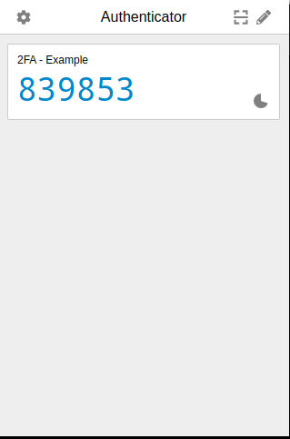

# typescript_two_factor_authentication

---

# How to run

1. install package

    ```properties
    $ npm i
    ```

2. create `.env` file with below content in root directory

    ```properties
    APP_PORT=4000
    ```

3. run the application

    ```properties
    $ npm run dev
    ```

4. Install Chrome Authenticator extension

5. Registor

    ```properties
    $ curl -X POST localhost:4000/api/register | jq
    ```

    output:

    ```json
    {
        "id": "af1fed53-a597-4356-b5b8-6bcc2c724cc3",
        "secret": "KMSUGQTNKR5UAWSALA2GOTCMENFSGODLORNSYVTVFRUXORCSF47A"
    }
    ```

6. add secret to Authenticator extension

    

7. Validate Secret

    ```properties
    $ curl -X POST -H "Content-Type: application/json" -d '{"userId": "af1fed53-a597-4356-b5b8-6bcc2c724cc3", "token": "955646"}'  localhost:4000/api/validate | jq
    ```

    output:

    ```json
    {
        "verified": false
    }
    ```